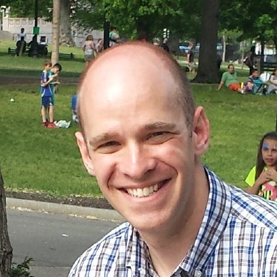
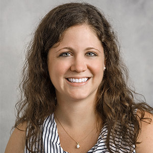

<section id="team" class="team">
      

	

          

            

              

              

                <h4>Betsy Sanders</h4>
                Associate Professor, Chair of Computer Science
                
Ph.D., Vanderbilt University

                
Research interests: computer graphics and animation.

                
Office: Briggs 212

                

                  <a href="mailto:sandersb@rhodes.edu"><i class="ri-mail-fill"></i></a>
                  <a href=""><i class="ri-earth-fill"></i></a>
                

              

            

          

          

            

              

              

                <h4>Phil Kirlin</h4>
                Associate Professor
                
Ph.D., University of Massachusetts Amherst

                
Research interests: artificial intelligence, machine learning, music informatics.

                
Office: Briggs 209

                

                  <a href="mailto:kirlinp@rhodes.edu"><i class="ri-mail-fill"></i></a>
                  <a href=""><i class="ri-earth-fill"></i></a>
                

              

            

          

          

            

              

              

                <h4>Marion Lang</h4>
                Assistant Professor
                
Ph.D., The Ohio State University

                
Research interests: specification and verification of distributed systems, large-scale distributed data processing and analytics systems.

                
Office: Briggs 211

                

                  <a href="mailto:langm@rhodes.edu"><i class="ri-mail-fill"></i></a>
                  <a href="https://ml8.github.io/"><i class="ri-earth-fill"></i></a>
                

              

            

          

          

            

              

              

                <h4>Brian Larkins</h4>
                Associate Professor
                
Ph.D., The Ohio State University

                
Research interests: parallel programming, programming languages, network security.

                
Office: Briggs 210

                

                  <a href="mailto:larkinsb@rhodes.edu"><i class="ri-mail-fill"></i></a>
                  <!--<a href=""><i class="ri-earth-fill"></i></a>-->
                

              

            

          

          
          

            

              

              

                <h4>Ross Sowell</h4>
                Assistant Professor
                
Ph.D., Washington University in St. Louis

                
Research interests: human-robot interaction, computer graphics, computer science education.

                
Office: Briggs 212

                

                  <a href="mailto:sowellr@rhodes.edu"><i class="ri-mail-fill"></i></a>
                  <!--<a href=""><i class="ri-earth-fill"></i></a>-->
                

              

            

          

          
          

            

              

              

                <h4>Matt Superdock</h4>
                Visiting Assistant Professor
                
Ph.D., Carnegie Mellon University

                
Research interests: topological methods, type theory, formal verification, automated reasoning.

                

                  <a href="mailto:superdockm@rhodes.edu"><i class="ri-mail-fill"></i></a>
                  <!--<a href=""><i class="ri-earth-fill"></i></a>-->
                

              

            

          

          
          

            

              

              

                <h4>Catie Welsh</h4>
                Associate Professor
                
Ph.D., University of North Carolina at Chapel Hill

                
Research interests: bioinformatics, computational genetics.

                

                  <a href="mailto:welshc@rhodes.edu"><i class="ri-mail-fill"></i></a>
                  <a href="http://www.cs.rhodes.edu/~welshc"><i class="ri-earth-fill"></i></a>
                

              

            

          

</section>
