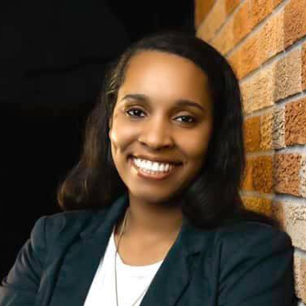

<section id="team" class="team">
      

	

          
          <!--

            

              

              

                <h4>Jessica Cowan</h4>
                Adjunct Assistant Professor
                
M.Ed., University of Southern California

                
Research interests: 

                
Office: Robertson 244

                
<a href="mailto:cowanj@rhodes.edu">Email</a> | <a href="https://www.rhodes.edu/bio/jessica-cowan">Website</a>

              

            

          
-->

          

            

              

              

                <h4>Jace King</h4>
                Visiting Assistant Professor
                
M.S., The College of William and Mary

                <!--
Research interests: augmented and virtual reality, perception, information visualization.
-->
                
Office: Briggs 210

                
<a href="mailto:kingj2@rhodes.edu">Email</a>

              

            

          

          

            

              

              

                <h4>Phillip Kirlin</h4>
                Associate Professor
                
Ph.D., University of Massachusetts Amherst

                
Research interests: artificial intelligence, machine learning, music informatics.

                
Office: Briggs 209

				
<a href="mailto:kirlinp@rhodes.edu">Email</a> | <a href="http://www.cs.rhodes.edu/~kirlinp">Website</a>

              

            

          

          

            

              

              

                <h4>Sean Kugele</h4>
                Assistant Professor
                
Ph.D., University of Memphis

                
Research interests: artificial intelligence, neuro-symbolic systems, cognitive modeling, bio-inspired computing.

                
Office: Briggs 203

				
<a href="mailto:kugeles@rhodes.edu">Email</a> | <a href="https://www.rhodes.edu/bio/sean-kugele">Website</a>

              

            

          

          

            

              

              

                <h4>Brian Larkins</h4>
                Associate Professor, Chair
                
Ph.D., The Ohio State University

                
Research interests: parallel programming, programming languages, network security.

                
Office: Briggs 213

				
<a href="mailto:larkinsb@rhodes.edu">Email</a> | <a href="https://www.rhodes.edu/bio/d-brian-larkins">Website</a>

              

            

          

          
          

            

              

              

                <h4>Betsy Sanders</h4>
                Professor
                
Ph.D., Vanderbilt University

                
Research interests: computer graphics and animation.

                
Office: Briggs 212

                
<a href="mailto:sandersb@rhodes.edu">Email</a> | <a href="https://www.rhodes.edu/bio/betsy-sanders">Website</a>

              

            

          

	      

            

              

              

                <h4>Addison Schwamb</h4>
                Assistant Professor
                
Ph.D., Washington University in St. Louis

                <!--
Research interests: bioinformatics, computational genetics.
-->
                
Office: Briggs 208

				
<a href="mailto:schwamba@rhodes.edu">Email</a>

              

            

          

          

            

              

              

                <h4>Matt Superdock</h4>
                Assistant Professor
                
Ph.D., Carnegie Mellon University

                
Research interests: topological methods, type theory, formal verification, automated reasoning.

                
Office: Briggs 207

                
<a href="mailto:superdockm@rhodes.edu">Email</a> | <a href="https://www.cs.rhodes.edu/~superdockm/">Website</a>

              

            

          

</section>
